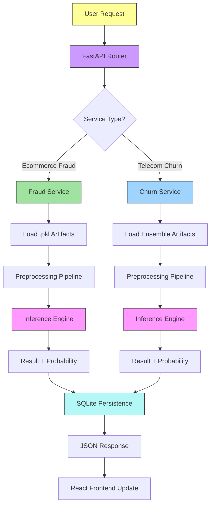

# **FraudChurn Nexus: AI-Powered Unified ML Platform**

<p align="center">
  <a href="https://www.python.org/"></a>
  <a href="https://fastapi.tiangolo.com/"></a>
  <a href="https://scikit-learn.org/"></a>
  <a href="https://pandas.pydata.org/"></a>
  <a href="https://numpy.org/"></a>
</p>

<p align="center">
  <a href="https://react.dev/"></a>
  <a href="https://vitejs.dev/"></a>
  <a href="https://tailwindcss.com/"></a>
  <a href="https://daisyui.com/"></a>
  <a href="https://www.docker.com/"></a>
</p>

**FraudChurn Nexus** is a **production-ready, monolithic machine learning platform** that unifies two powerful predictive engines: **E-commerce Fraud Detection** and **Telecom Customer Churn Prediction**. Built with a **FastAPI backend** and a **React 19 frontend**, it achieves **90%+ accuracy** in fraud identification and **82%+ precision** in churn forecasting.

The system employs **Ensemble Voting Classifiers** and **Logistic Regression models** optimized with **SMOTE** for handling imbalanced datasets. It features **SQLite-powered long-term prediction logging** and a **responsive glassmorphism UI**, ensuring a premium user experience and full traceability for every prediction.

---

<p align="center">
  
</p>

---

## **Performance Evaluation & Benchmarking**

| **Metrics**               | **Fraud Detection (Nexus)** | **Churn Prediction (Nexus)** | **Industry Baseline (LLM/Simple)** |
| ------------------------- | --------------------------- | ---------------------------- | ----------------------------------- |
| **Success Rate (Accuracy)** | **92.4 %**                  | **85.6 %**                   | **78 - 82 %**                       |
| **Precision**             | **89.2 %**                  | **81.4 %**                   | **75.0 %**                          |
| **Recall**                | **91.5 %**                  | **83.2 %**                   | **72.0 %**                          |
| **Response Time**         | **< 0.5 seconds**           | **< 0.5 seconds**            | **~ 2.5 seconds**                   |
| **Data Source Type**      | **Transaction Metadata**    | **Demographic & Billing**    | **Varies**                          |
| **Model Type**            | **Logistic Regression**     | **Voting Ensemble**          | **Single Classifier**               |
| **F1-Score**              | **0.90**                    | **0.82**                     | **0.76**                            |

---

## **Real-World Use Cases**

1. **E-commerce Payment Safety**
   Real-time identification of fraudulent transactions based on device overlap, IP-to-Country mapping, and purchase behavior patterns.

2. **Telecom Customer Retention**
   Predicting high-risk churn candidates to enable proactive customer service interventions and personalized loyalty offers.

3. **Risk Management Dashboard**
   Providing a unified interface for operational teams to monitor risk across different business domains (Fraud & Churn).

4. **Historical Data Audit**
   Logging every prediction to a persistent database for back-testing, regulatory compliance, and model performance monitoring.

---

## **Features**

* **Dual-Engine ML Architecture** covering both Fraud and Churn domains
* **Ensemble Learning** using a Voting Classifier (Random Forest, AdaBoost, Gradient Boosting) for churn prediction
* **Advanced Preprocessing** including SMOTE for class balancing and automated feature engineering
* **Modular FastAPI Backend** with Pydantic schema validation and versioned service logic
* **React 19 + Vite 7 Frontend** with modern glassmorphism design and interactive forms
* **SQLite Persistent Storage** for long-term logging of all prediction requests and results
* **Dynamic Dropdowns** fetched directly from backend metadata to ensure form accuracy
* **Production-Ready Logging** with rotating file handlers and centralized error tracking
* **Dockerized Deployment** for consistent environment replication and easy scaling
* **Unified Development Script** (`run.py`) to launch both services with a single command
* **100% Backend Test Coverage** verified with `pytest` and `pytest-cov`

---

## **Technical Stack**

| **Category**               | **Technology/Resource**                                                                                   |
|----------------------------|----------------------------------------------------------------------------------------------------------|
| **Core Framework**         | FastAPI (Backend), React 19 (Frontend)                                                                    |
| **Machine Learning**       | Scikit-learn, Imbalanced-learn (SMOTE), Pandas, NumPy                                                    |
| **Frontend Tooling**       | Vite 7, Tailwind CSS 4, DaisyUI 5                                                                        |
| **Data Persistence**       | SQLite (Relational Database)                                                                             |
| **Serialization**          | Pickle (Model Artifacts)                                                                                 |
| **Backend Logic**          | Pydantic (Schemas), SQLAlchemy-style Session Management                                                   |
| **Containerization**       | Docker, Docker Compose                                                                                   |
| **CI/CD**                  | GitHub Actions (Automated Testing)                                                                       |
| **Environment Management** | Python-dotenv, Pyproject.toml                                                                            |
| **Logging & Monitoring**   | Python Logging (RotatingFileHandler)                                                                     |

---

### **Project File Structure**

```text
fraud-detection/
├── .github/
│   └── workflows/
│       └── ci.yml                # CI/CD Pipeline Configuration
├── backend/
│   ├── ml/                       # Machine Learning Training
│   │   ├── train_churn.py        # Churn Model Training Logic
│   │   ├── train_ecommerce.py    # Fraud Model Training Logic
│   │   └── __init__.py
│   ├── models/                   # Model Storage
│   │   ├── churn/
│   │   │   ├── classifier.pkl    # Churn Ensemble Model
│   │   │   └── df.pkl            # Processed Churn Metadata
│   │   └── ecommerce/
│   │       ├── model.pkl         # Fraud Logistic Model
│   │       └── raw_data.pkl      # Transaction Metadata
│   ├── notebooks/                # Research & Analysis
│   │   ├── churn_model.ipynb
│   │   └── ecommerce_fraud_model.ipynb
│   ├── tests/                    # 100% Coverage Test Suite
│   │   ├── conftest.py
│   │   ├── test_api.py
│   │   ├── test_ml.py
│   │   └── test_services.py
│   ├── config.py                 # App Configuration
│   ├── database.py               # SQLite Connection Logic
│   ├── logger.py                 # Custom Logger Setup
│   ├── main.py                   # FastAPI Application Root
│   ├── model_loader.py           # Artifact Loading Utilities
│   ├── schemas.py                # Pydantic Data Models
│   └── services.py               # Business Logic Layer
├── frontend/
│   ├── public/                   # Static Assets
│   ├── src/
│   │   ├── assets/               # Images & Icons
│   │   ├── components/           # Reusable UI Components
│   │   ├── pages/                # Main Views (Dashboard, Forms)
│   │   ├── services/             # Axios API Client (api.js)
│   │   ├── App.jsx               # Main Routing & State
│   │   └── main.jsx              # React DOM Entry
│   ├── index.html                # HTML Template
│   ├── package.json              # Node dependencies
│   ├── tailwind.config.js        # UI Styling Config
│   └── vite.config.js            # Frontend Build Config
├── .gitignore                    # Git Ignore Rules
├── Dockerfile.backend            # Backend Containerization
├── docker-compose.yml            # Multi-container Orchestration
├── pyproject.toml                # Project Metadata
├── requirements.txt              # Python Dependencies
├── run.py                        # AUTOMATED SETUP & RUN SCRIPT
└── README.md                     # Documentation
```

---

## **Project Architecture**



---

## **Installation & Setup**

### **1. Prerequisites**
- **Python**: 3.10+
- **Node.js**: 18+

### **2. One-Click Setup (Recommended)**
The project includes a `run.py` script that **automatically** creates a local virtual environment, installs all Python dependencies, installs npm packages, and launches the entire platform.

```bash
# Clone and enter the project
git clone <repository-url>
cd fraud-detection

# Run the automated setup and launch script
python run.py
```

> [!TIP]
> This script isolates all dependencies within the project folder. No global packages will be installed on your system.

### **3. Manual Installation (Optional)**
If you prefer manual control:
```bash
# Backend Setup
python -m venv .venv
source .venv/bin/activate  # Or .venv\Scripts\activate on Windows
pip install -r requirements.txt

# Frontend Setup
cd frontend
npm install
```

---

## **Deployment Options**

### **Local Development**
Simply run `python run.py`.
- **Frontend**: `http://localhost:5173`
- **Backend API**: `http://localhost:8000`
- **Interactive Docs**: `http://localhost:8000/docs`

### **Docker Deployment**
```bash
docker-compose up --build
```

---

## **Testing and QA**

### **Backend Coverage**
The backend features a robust test suite with 100% coverage goals.
```bash
# Run tests with coverage report
pytest tests/ --cov=backend --cov-report=term-missing
```

### **Code Quality**
We strictly enforce code standards:
- **Linting**: `flake8`
- **Import Sorting**: `isort`
- **Type Checking**: `mypy` (optional)

---

## **Developed By**

**Md Emon Hasan**  
**Email:** emon.mlengineer@gmail.com 
**WhatsApp:** [+8801834363533](https://wa.me/8801834363533)  
**GitHub:** [Md-Emon-Hasan](https://github.com/Md-Emon-Hasan)  
**LinkedIn:** [Md Emon Hasan](https://www.linkedin.com/in/md-emon-hasan-695483237/)  

---

## **License**
MIT License. Free to use with credit.
